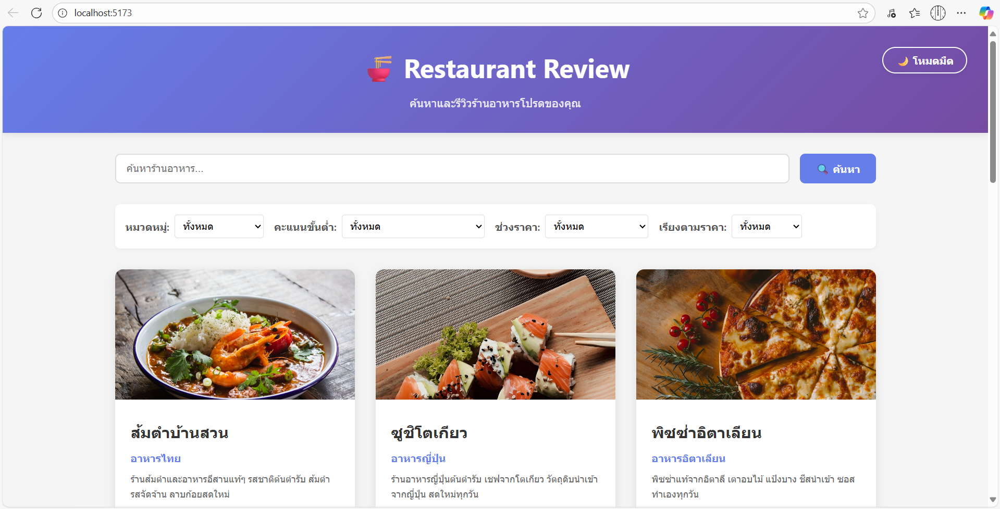
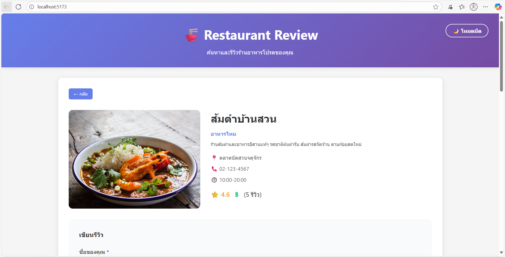
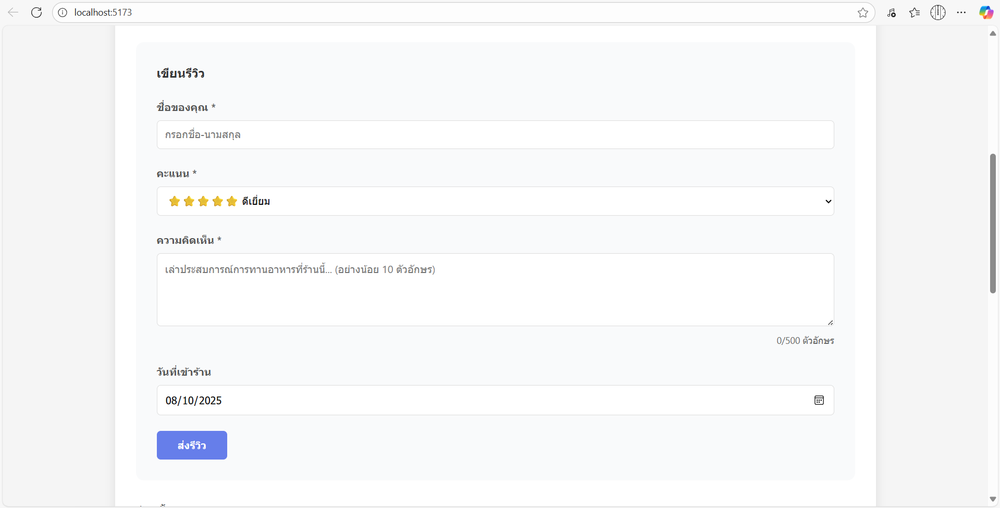

# Restaurant Review Website

## รายละเอียดโปรเจค
เว็บไซต์รีวิวร้านอาหารที่ช่วยให้สามารถค้นหา ดูรายละเอียดร้าน กรองร้านตามหมวดหมู่/เรตติ้ง/ราคา และเพิ่มรีวิวร้านอาหารได้อย่างสะดวก ข้อมูลร้านและรีวิวถูกจัดเก็บในรูปแบบไฟล์ JSON เหมาะสำหรับการทดลองและเรียนรู้การพัฒนาเว็บแอปพลิเคชันแบบ Full Stack

## เทคโนโลยีที่ใช้
- **Frontend: React 18 + Vite**
	ใช้ React 18 สำหรับสร้าง UI แบบ component-based ที่ทันสมัยและตอบสนองไว ร่วมกับ Vite ซึ่งเป็น build tool ที่ช่วยให้การพัฒนาและ build frontend เร็วขึ้นมาก
- **Backend: Node.js + Express**
	ใช้ Node.js ในการรันฝั่งเซิร์ฟเวอร์ และ Express เป็น web framework ที่ช่วยให้สร้าง REST API ได้อย่างรวดเร็วและจัดการ routing, middleware ได้อย่างยืดหยุ่น
- **Database: JSON File Storage**
	ข้อมูลร้านอาหารและรีวิวถูกจัดเก็บในไฟล์ JSON บนเซิร์ฟเวอร์ เหมาะสำหรับโปรเจคขนาดเล็กหรือการทดลอง ไม่ต้องติดตั้งฐานข้อมูลจริง

## โครงสร้างไฟล์สำคัญ

### Backend
```
backend/
├── data/
│   └── restaurants.json     # ไฟล์ JSON สำหรับเก็บข้อมูลร้านอาหารและรีวิว
├── routes/
│   ├── restaurants.js       # API routes สำหรับจัดการร้านอาหาร
│   └── reviews.js           # API routes สำหรับจัดการรีวิว
├── .env.example             # เทมเพลตไฟล์ environment variables
├── .env                     # ไฟล์ตั้งค่า environment variables (เช่น พอร์ต)
├── server.js                # ไฟล์หลักสำหรับรัน Express server
├── package.json             # ไฟล์กำหนด dependencies และ scripts
└── README.md                # คำอธิบายเฉพาะส่วน backend (ถ้ามี)
```

### Frontend
```
frontend/
├── public/                  # ไฟล์สาธารณะ เช่น favicon, ภาพ
├── src/
│   ├── assets/              # รูปภาพหรือไฟล์ static อื่นๆ
│   ├── components/          # React components เช่น RestaurantCard, ReviewForm
│   ├── pages/               # หน้าเพจ เช่น Home, RestaurantDetail
│   ├── App.jsx              # ไฟล์หลักของ React app
│   ├── main.jsx             # Entry point สำหรับรัน React
│   └── styles/              # ไฟล์ CSS หรือ Tailwind configuration
├── vite.config.js           # การตั้งค่า Vite
├── package.json             # ไฟล์กำหนด dependencies และ scripts
└── README.md                # คำอธิบายเฉพาะส่วน frontend (ถ้ามี)
```

## Features ที่ทำได้
### Required Features (70 คะแนน)
- [x] แสดงรายการร้านอาหาร
- [x] ค้นหาร้าน
- [x] กรองตามหมวด/rating/ราคา
- [x] ดูรายละเอียดร้าน
- [x] เพิ่มรีวิว
- [x] Validation
- [x] อัพเดท rating อัตโนมัติ

### Bonus Features (ถ้ามี)
- [x] Sort restaurants
- [x] Responsive design
- [x] Animations

## วิธีติดตั้งและรัน

### Backend
```bash
cd backend
npm install
cp .env.example .env
npm run dev
```

### Frontend
```bash
cd frontend
npm install
npm run dev
```

## API Endpoints
- GET `/api/restaurants` - ดึงรายการร้านทั้งหมด
- GET `/api/restaurants/:id` - ดึงร้านตาม ID
- POST `/api/reviews` - เพิ่มรีวิว
- GET `/api/stats` - ดึงสถิติ

## Screenshots
### หน้าแรก


### รายละเอียดร้าน


### ฟอร์มรีวิว


## ผู้พัฒนา
- วิศรุต กอบคำ
- รหัสนักศึกษา : 68543210083-0
- Email : witsarut@live.rmutl.ac.th

## License
MIT License
